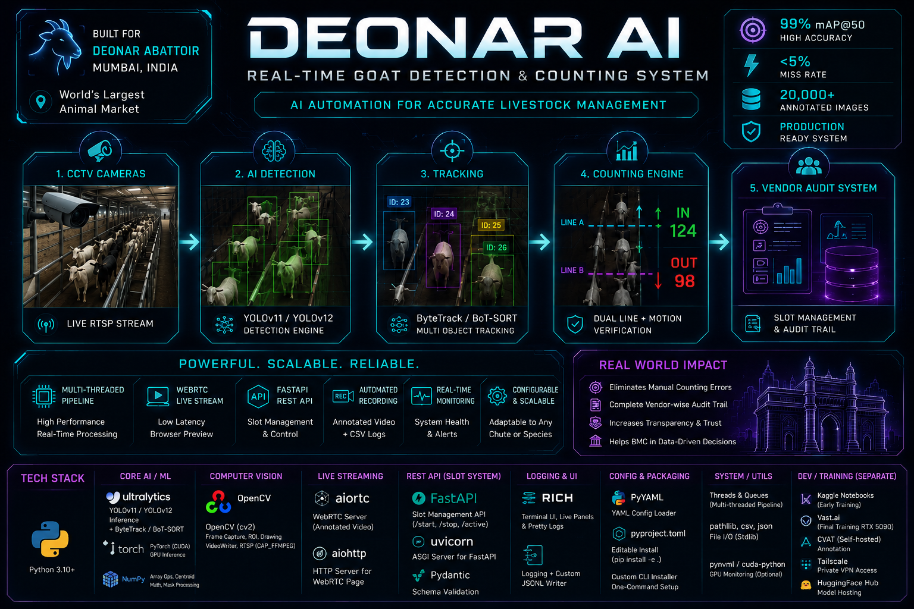
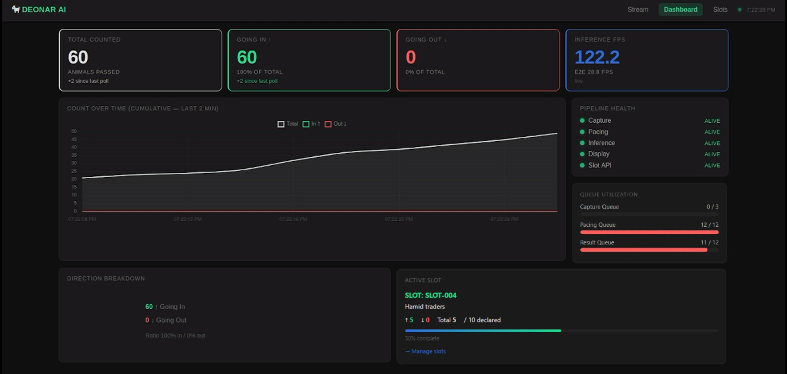
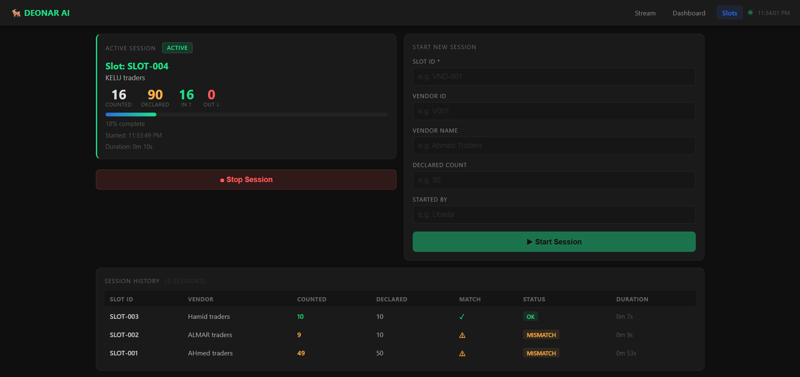
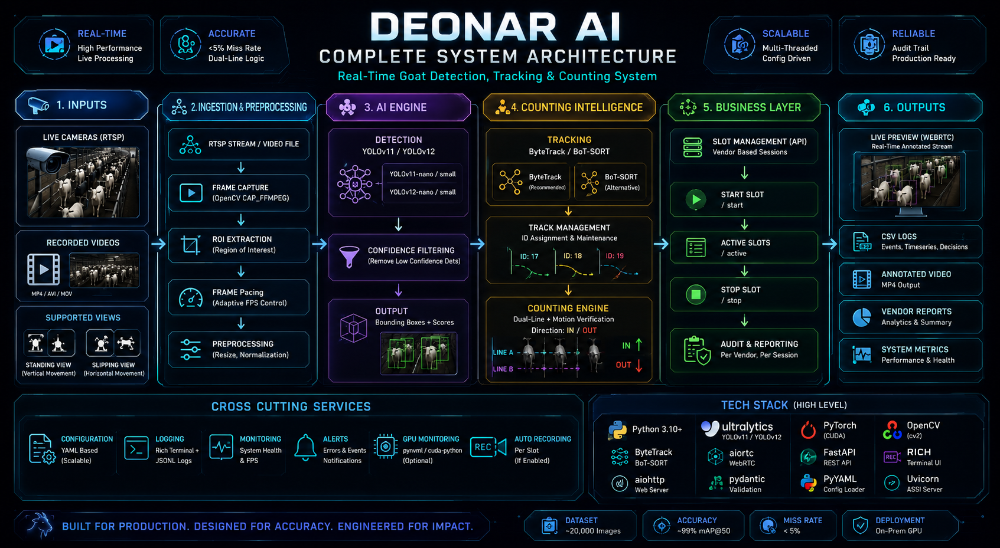
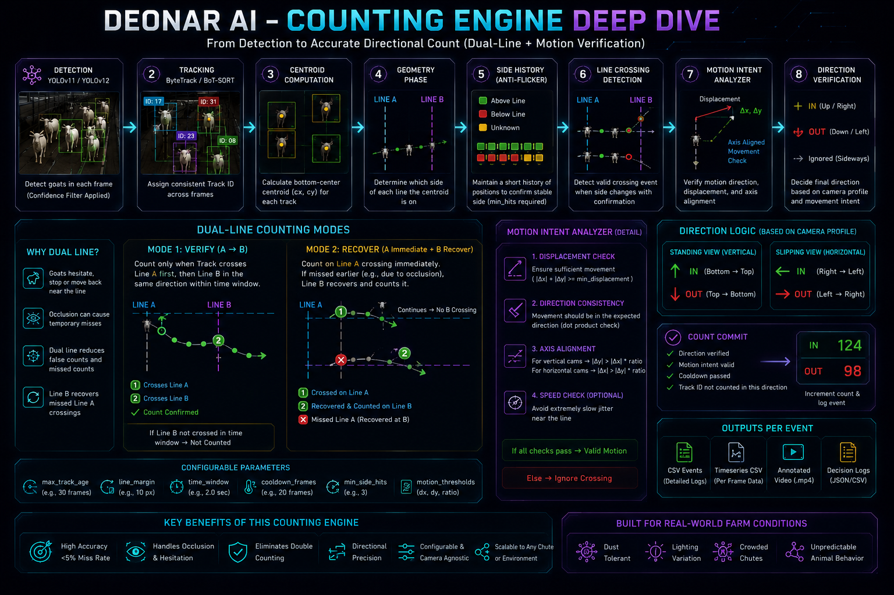
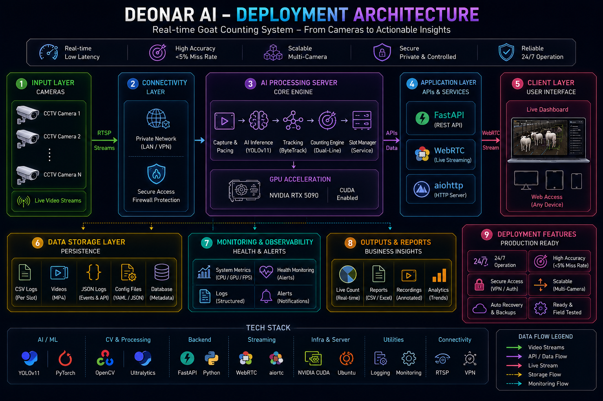

<h1 align="center">DEONAR AI</h1>

<p align="center">
Real-Time Livestock Detection, Tracking & Counting Platform
</p>

<p align="center">
Built for Deonar Abattoir, Mumbai
</p>

<p align="center">
  
  
  
  
  
  
  
  
  
</p>

---

# Overview

DEONAR AI is a production-grade livestock counting platform developed to automate animal counting operations at Deonar Abattoir, Mumbai.

The platform combines computer vision, object tracking, counting intelligence, vendor session management, and real-time streaming to replace manual counting processes with an accurate, auditable, and scalable AI solution.

### Key Highlights

* Real-time livestock counting from CCTV feeds
* YOLOv11 & YOLOv12 object detection
* ByteTrack & BoT-SORT multi-object tracking
* Dual-line counting intelligence
* Vendor slot management system
* Browser-based WebRTC live monitoring
* Multi-threaded processing pipeline
* CSV audit trail and reporting
* Production-ready deployment architecture

---

# System Overview

<p align="center">
  
</p>

<p align="center">
  <i>
  End-to-end overview of the Deonar AI livestock counting platform.
  </i>
</p>

---

# Demo

<p align="center">
  <a href="https://youtu.be/Ph46W8hf8gw">
    
  </a>
</p>

<p align="center">
  <i>
  Click the preview above to watch the complete end-to-end system demonstration.
  </i>
</p>

<p align="center">

<a href="https://youtu.be/Ph46W8hf8gw">

</a>

<a href="https://youtu.be/wzZNj39ZOIA"> 

</a>

</p>

### What the Demo Covers

* Live CCTV ingestion

* Real-time goat detection

* Multi-object tracking

* Dual-line counting intelligence

* Vendor session management

* Browser-based monitoring

* Audit reporting and analytics

### Annotated Output

The annotated output video showcases:

* YOLO detections

* Tracking IDs

* Counting line interactions

* Live count updates

* Real-time visual overlays

---

# User Interface

<table>
<tr>

<td width="50%">

### Live Monitoring Dashboard



</td>

<td width="50%">

### Slot Management Console



</td>

</tr>
</table>

<p align="center">
<i>
Monitor live counting sessions, track vendor operations, and access audit-ready reports through a centralized interface.
</i>
</p>

# Documentation

For readers interested in the technical implementation details, counting algorithms, deployment architecture, project journey, and system design decisions, see:

- 📘 [DOCUMENTATION.md](DOCUMENTATION.md) — Complete technical and project documentation
  
---

# Complete System Architecture

<p align="center">
  
</p>

<p align="center">
  <i>
  Complete architecture showing video ingestion, AI processing, counting intelligence, vendor management, and reporting.
  </i>
</p>

### Core Workflow

```text
CCTV Feed / Video
          ↓
YOLO Detection
          ↓
Multi-Object Tracking
          ↓
Counting Intelligence
          ↓
Vendor Slot Mapping
          ↓
Reports & Audit Trail
```

---

# Counting Intelligence Engine

<p align="center">
  
</p>

<p align="center">
  <i>
  Motion-aware counting engine designed to ensure every animal is counted exactly once.
  </i>
</p>

The counting engine combines:

* Object Detection
* Multi-Object Tracking
* Motion Validation
* Direction Analysis
* Count Confirmation Logic
* Dual-Line Verification

### Supported Counting Modes

#### 1) Single-Line Counting

Counts animals crossing a single virtual counting line with anti-flicker validation and cooldown protection.

#### 2) Dual-Line Counting (Recommended)

Uses Line A → Line B verification combined with motion validation and direction consistency checks to maximize counting accuracy.

#### 3) Zone Counting

Counts entries and exits within a configurable region of interest, suitable for pen monitoring and wider gate scenarios.

---

# Deployment Architecture

<p align="center">
  
</p>

<p align="center">
  <i>
  Production deployment architecture supporting local and remote monitoring.
  </i>
</p>

### Live Streaming

- The platform streams annotated video through WebRTC and can be deployed on a remote server for browser-based monitoring.

- Operators can securely monitor live counting sessions from anywhere without requiring direct access to the processing machine.

---

# Technology Stack

### ➤ AI & Deep Learning

* PyTorch
* Ultralytics
* YOLOv11
* YOLOv12

### ➤ Tracking

* ByteTrack
* BoT-SORT

### ➤ Computer Vision

* OpenCV
* NumPy

### ➤ Live Streaming

* WebRTC
* aiortc
* aiohttp

### ➤ Backend & APIs

* FastAPI
* Uvicorn
* Pydantic

### ➤ Monitoring & Logging

* Rich
* JSONL Logging
* CSV Reporting

### ➤ Infrastructure & Training

* CVAT
* Vast.ai (RTX 5090)
* HuggingFace Hub
* Tailscale

---

# Pre-Trained Models

Models were trained on a custom dataset of more than 20,000 annotated livestock images collected under real operational conditions at Deonar Abattoir.

| Model         | mAP@50 | mAP@50-95 | Size    |
| ------------- | ------ | --------- | ------- |
| YOLOv11 Nano  | 98.99% | 78.05%    | ~5.4 MB |
| YOLOv11 Small | 99.05% | 79.00%    | ~19 MB  |
| YOLOv12 Nano  | 99.04% | 78.12%    | ~5.4 MB |
| YOLOv12 Small | 99.09% | 79.43%    | ~19 MB  |

### Download Models

Models are hosted on HuggingFace:

```text
https://huggingface.co/ubada11/goat-detection-yolov11
```

Download the preferred model and place it inside:

```text
models/
```

before starting the application.

---

# Dataset & Training

| Metric                  | Value             |
| ----------------------- | ----------------- |
| Dataset Size            | 20,000+ Images    |
| Annotation Platform     | CVAT              |
| Training Infrastructure | Vast.ai RTX 5090  |
| Detection Models        | YOLOv11 & YOLOv12 |
| Validation Accuracy     | ~99% mAP@50       |

The dataset was collected and annotated directly from operational livestock counting environments under varying camera angles, lighting conditions, densities, and weather conditions.

### Dataset Access

The dataset used for training was collected from real-world livestock counting environments and is not publicly distributed.

For academic, research, or industry collaboration inquiries regarding dataset availability, please contact:

**Ubada Ghawte**
📧 [ubadaghawte2005@gmail.com](mailto:ubadaghawte2005@gmail.com)

---

# Results

| Metric             | Performance              |
| ------------------ | ------------------------ |
| Detection Accuracy | ~99% mAP@50              |
| Miss Rate          | < 5%                     |
| Processing Mode    | Real-Time                |
| Tracking           | ByteTrack / BoT-SORT     |
| Streaming          | WebRTC                   |
| Reporting          | CSV + Video + Audit Logs |

---

# Real-World Deployment

The platform was designed and tested for livestock counting operations at Deonar Abattoir, Mumbai.

Supported capabilities include:

* Automated livestock counting
* Vendor session management
* Browser-based live monitoring
* Remote deployment support
* Audit-ready reporting
* Operational analytics

---

# Project Structure

```text
├── assets/ # Project media and documentation assets 
│   ├── architecture/ # System architecture diagrams and workflow visuals 
│   ├── screenshots/ # Application UI screenshots 
│   ├── demo/ # Demo videos and recordings 
│   └── banner/ # Repository banners and branding images 
│ 
├── configs/ # Configuration files (models, streams, counting settings) 
├── models/ # Downloaded and trained AI model weights 
├── outputs/ # Generated reports, logs, videos, and run artifacts 
├── src/ # Core application source code 
│   ├── capture/ # Video capture and stream ingestion modules
│   ├── infer/ # YOLO inference and detection pipeline 
│   ├── counting/ # Counting logic and event processing 
│   ├── display/ # Visualization, overlays, and UI rendering 
│   ├── slots/ # Vendor slot/session management system 
│   ├── geometry/ # Lines, zones, ROIs, and spatial calculations 
│   ├── runtime/ # Runtime orchestration and application services 
│   └── utils/ # Shared helper functions and utilities 
│
├── main.py # Application entry point 
├── pyproject.toml # Project metadata and build configuration 
├── requirements.txt # Python dependency list 
└── README.md # Project documentation
```

---

# Installation

### Recommended Setup

```bash
git clone https://github.com/Ubada12/Deonar-AI.git

cd Deonar-AI

python -m venv .venv

# Windows
.venv\Scripts\activate

# Linux / macOS
source .venv/bin/activate

pip install -e .
```

### Enhanced Installer

The project includes an enhanced installer capable of:

* CUDA detection
* PyTorch installation
* NVIDIA monitoring dependencies
* Environment validation

```bash
setup-installer \
  --install-cuda-python \
  --install-nvidia-ml \
  --auto-detect-torch
```
## ⚠️ Warning

* Before running the application, download the required detection model from the HuggingFace repository and place the model file inside the `models/` directory. The application does not automatically download model weights, so this step is required for successful inference.

* Ensure that the model path specified in `configs/config.yaml` matches the model file you placed in the `models/` directory. Incorrect paths or model names will prevent the application from starting correctly.

* The default `config.yaml` is configured for beginners and is suitable for getting started quickly with the project. However, if you plan to use Deonar AI for a different deployment environment, camera setup, counting scenario, custom model, RTSP stream, or any other use case, you should review and update the configuration values according to your requirements.

* Always verify settings such as model paths, video sources, counting lines, tracking parameters, output locations, and streaming options in `configs/config.yaml` before deployment to ensure the system behaves as expected in your environment.

---

# Quick Start

Configure your model and video source in:

```text
configs/config.yaml
```

Run:

```bash
python main.py
```

The application supports:

* RTSP streams
* CCTV cameras
* Local video files

---

# Generated Outputs

Every run generates structured outputs including:

* Event Logs
* Count Time Series
* Decision Traces
* Performance Metrics
* Annotated Videos
* Vendor Session Reports
* Summary Reports

Output structure:

```text
outputs/runs/<run_id>/
```

---

# Contributors

<table>
<tr>
<td align="center" width="200px">
<b>🧑‍💼 Project Lead</b><br><br>
<a href="https://github.com/Ubada12"><b>Ubada Ghawte</b></a><br>
<sub>Lead ML Developer & Full Stack Developer</sub>
</td>
<td align="center" width="200px">
<b>👥 Team Members</b><br><br>
<b> ➤ Adil</b><br>
<b> ➤ Raafe</b>
</td>
<td align="center" width="200px">
<b>🎓 Academic Guide</b><br><br>
<b>Prof. Farhan</b><br>
<sub>Rizvi College of Engineering</sub>
</td>
<td align="center" width="200px">
<b>🏭 Industry Partner</b><br><br>
<b>MI Tradings &</b><br>
<b>General Suppliers</b>
</td>
</tr>
</table>

---

# License

Licensed under the Apache License 2.0.

See the LICENSE file for details.
